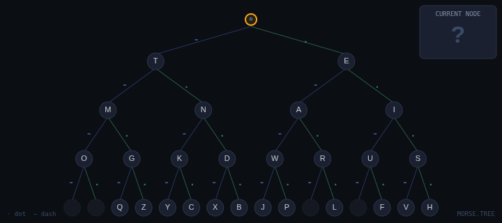

# 🌳 Morse.Tree

An interactive Morse code binary tree visualizer — navigate the tree by dot and dash, hear real tones, and watch the path light up in real time.



---

## ✨ Features

| Feature | Description |
|---|---|
| 🌲 **Interactive Binary Tree** | Visual SVG tree showing all 26 letters at their morse positions |
| 🧭 **Live Navigation** | Click DOT / DASH buttons or use the keyboard to walk the tree node by node |
| 🔊 **Audio Feedback** | Real Web Audio API tones — distinct sounds for dot, dash, error, and reset |
| 📝 **Text → Morse Converter** | Type any message and see it encoded instantly with per-character breakdown |
| ▶️ **Animated Playback** | Plays your message through the tree letter by letter, highlighting the active node |
| 📋 **Copy Morse Output** | One-click copy of the full encoded morse string |
| ⇄ **Flip Mode** | Mirror the tree layout (dot left / dash right) |
| ⌨️ **Full Keyboard Support** | Navigate without touching the mouse |
| 🔇 **Mute Toggle** | Silence audio without losing any functionality |
| 📍 **Path Trail** | Breadcrumb trail shows your full navigation history at each step |

---

## 🚀 Getting Started

No build step, no dependencies, no framework — just open and run.

```bash
git clone https://github.com/your-username/morse-tree.git
cd morse-tree
open index.html        # macOS
# or
start index.html       # Windows
# or serve with any static server:
npx serve .
```

---

## ⌨️ Keyboard Shortcuts

| Key | Action |
|---|---|
| `.` or `E` | Navigate DOT |
| `-` or `T` | Navigate DASH |
| `R` / `Esc` | Reset to root |
| `Backspace` | Go one step back |
| `M` | Toggle mute |

---

## 🗂️ File Structure

```
morse-tree/
├── index.html      # Layout and markup
├── style.css       # Dark theme, animations, responsive grid
└── visual.js       # Tree data, SVG renderer, audio engine, playback
```

---

## 🌲 How the Tree Works

Morse code is a binary tree. Every letter lives at a unique path of dots and dashes from the root:

```
          ⊙ (root)
         / \
        ·   −
       E     T
      / \   / \
     ·   − ·   −
     I   A N   M
   ...         ...
```

- Follow a **dot (·)** → move right
- Follow a **dash (−)** → move left
- The letter at your current node is your decoded character

---

## 🎛️ Playback Engine

The playback engine animates each character of your typed message through the tree:

1. Resets the current position to root
2. Walks each symbol (dot/dash) in the letter's morse code one by one
3. Highlights the active node and edge on the tree
4. Plays the corresponding tone (short for dot, long for dash)
5. Waits the correct inter-symbol and inter-letter gaps
6. Moves to the next character

Speed is controlled by a 1–5 slider which scales the base unit time.

---

## 🎨 Tech Stack

- **Vanilla HTML / CSS / JS** — zero dependencies
- **SVG** — fully programmatic tree rendering
- **Web Audio API** — real oscillator-based morse tones
- **CSS custom properties** — full dark theme via variables
- **Google Fonts** — Share Tech Mono + Outfit

---

## 📄 License

MIT — do whatever you want with it.
